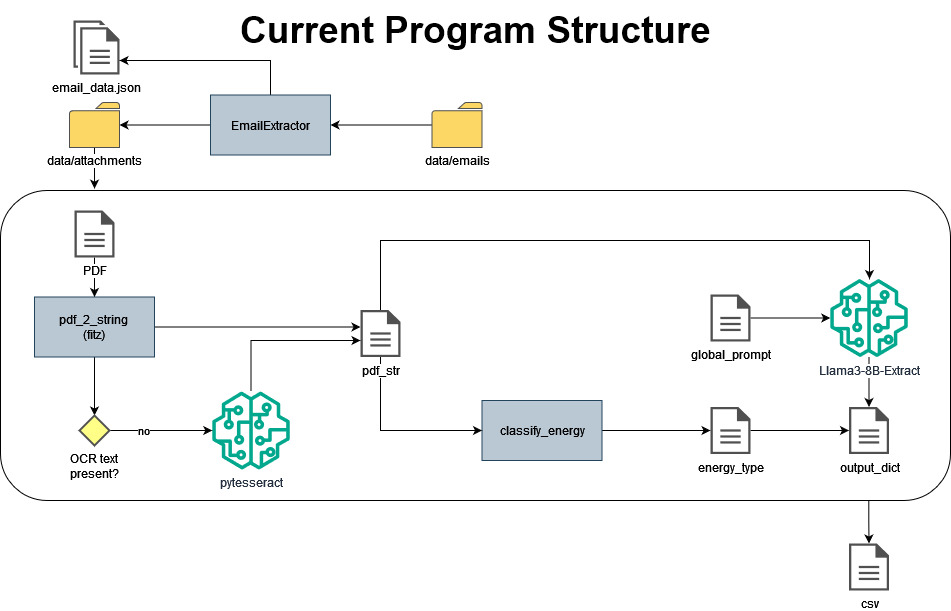
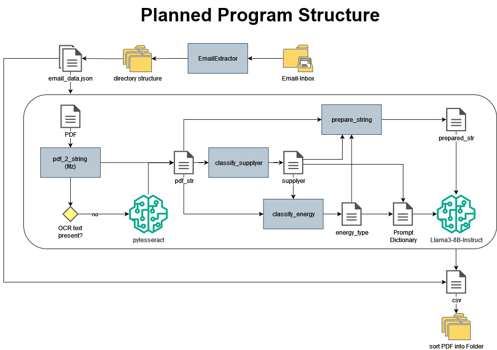

# invoicereadingassistant


## Requirements

### On Windows
Download Poppler for Windows:

Download the latest Poppler package from the Poppler for Windows website.
Extract the Poppler ZIP:

Extract the downloaded ZIP file to a location of your choice (e.g., C:\poppler).
Add Poppler to PATH:

Open the Start Menu and search for "Environment Variables".
Click on "Edit the system environment variables".
In the System Properties window, click on the "Environment Variables" button.
In the Environment Variables window, under System variables, find the Path variable, select it, and click "Edit".
Click "New" and add the path to the poppler/bin directory (e.g., C:\poppler\bin).
Click OK to close all windows.


Steps to install Tesseract OCR on Windows and configure your script correctly.

Step 1: Install Tesseract OCR
Download Tesseract:
Download the Tesseract installer for Windows from the official repository: Tesseract at UB Mannheim.
Install Tesseract:
Run the installer and follow the instructions to install Tesseract on your system.
Note the installation path (e.g., C:\Program Files\Tesseract-OCR).
Step 2: Add Tesseract to PATH
Open Environment Variables:

Open the Start Menu and search for "Environment Variables".
Click on "Edit the system environment variables".
In the System Properties window, click on the "Environment Variables" button.
Edit the PATH Variable:

In the Environment Variables window, under System variables, find the Path variable, select it, and click "Edit".
Click "New" and add the path to the Tesseract executable (e.g., C:\Program Files\Tesseract-OCR).
Verify the Installation:

Open a new Command Prompt window and type tesseract --version. If the installation is successful, it should display the Tesseract version.


### On Linux

#### virtual environment and python modules
In your terminal, run thre following code:
```
python3 -m venv .venv
source .venv/bin activate
pip install --upgrade pip
pip install -r requirements.txt
```
#### Other packages
Poppler and tesseract need to be installed. 
```
sudo apt install poppler-utils
sudo apt install tesseract-ocr
sudo apt install tesseract-ocr-deu
```
#### LM Studio
You need LM-studio and run the models there. 


## Program structure
Currently, the structure looks like this: 



The planned structure looks like this: 
